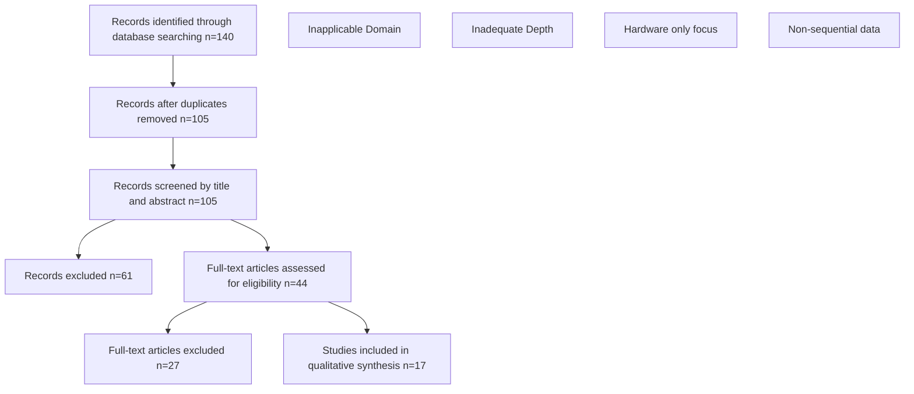
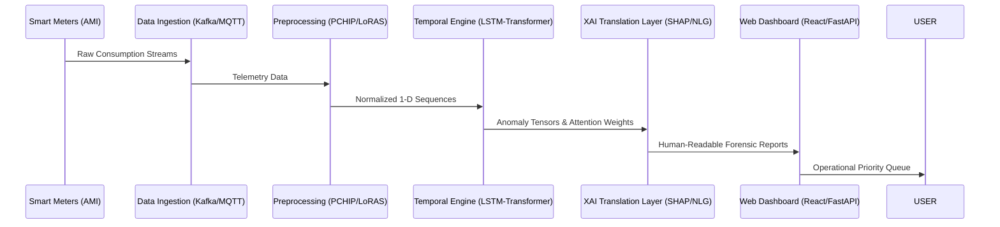

# GridGuard AI: A Full-Stack Architecture for Explainable, Deployable Electricity Theft Detection in Smart Grids – A Critical Review

**Abstract**  
The integration of Advanced Metering Infrastructure (AMI) in modern smart grids has revolutionized energy monitoring but simultaneously expanded the attack surface for electricity theft. While recent innovations in Artificial Intelligence (AI) and Deep Learning (DL) have achieved high detection accuracy in simulated environments, a critical disconnect remains between algorithmic sophistication and operational readiness in utility contexts. This paper presents a systematic review of 17 seminal studies (2019–2024), synthesizing six dominant architectural paradigms: traditional machine learning, convolutional networks, recurrent hybrids, transformers, ensemble frameworks, and reinforcement learning. Our analysis identifies three systemic barriers to real-world adoption: (1) the "black-box" nature of advanced models lacking Explainable AI (XAI) for auditable decision-making; (2) fragmented temporal optimization that disrupts chronological data dependencies; and (3) a significant deployment gap characterized by the absence of production-ready software architectures. To bridge these gaps, we propose **GridGuard AI**, a conceptual full-stack framework that integrates native temporal modeling (LSTM-Transformer hybrid) with an XAI translation layer and a containerized REST API for seamless dashboard integration. This work emphasizes the transition from isolated accuracy metrics to end-to-end operational utility, providing a reproducible roadmap for securing future smart grids.

**Keywords**: Electricity Theft Detection (ETD), Smart Grids, Explainable AI (XAI), Deep Learning, PRISMA, GridGuard AI, System Architecture.

---

## 1. Introduction

### 1.1 Background: The Transformation of Power Grids
The global energy sector is undergoing a profound transformation from traditional, electromechanical unidirectional grids to complex, bi-directional "Smart Grids." At the core of this transition is the Advanced Metering Infrastructure (AMI), which enables real-time data exchange between utilities and consumers. However, this digitalization has heightened vulnerability to Non-Technical Losses (NTLs), primarily driven by electricity theft. Globally, these losses account for approximately $96 billion annually, undermining economic stability and grid reliability (World Bank, 2020).

Electricity theft manifests in physical forms (e.g., meter bypassing, magnetic tampering) and sophisticated cyber-physical attacks (e.g., data manipulation in AMI networks). Unrecorded loads can lead to transformer failure, reduced power quality, and public safety risks (Lepolesa et al., 2022; Elshennawy et al., 2025). This has necessitated the development of data-driven Electricity Theft Detection (ETD) systems, often benchmarked against datasets like the State Grid Corporation of China (SGCC), which reflect the non-linear, imbalanced, and noisy nature of real-world energy data.

### 1.2 Problem Statement: The Gap in Operational Intelligence
Despite the abundance of AMI telemetry, distinguishing malicious theft from normal behavioral changes (e.g., energy-efficient appliance upgrades or seasonal holidays) remains a significant challenge. Traditional statistical methods often yield high False Positive Rates (FPR), leading to errosion of consumer trust and increased operational costs for utility providers. The core problem is not merely anomaly detection, but the categorization of time-series behavior into verifiable, auditable theft signatures.

### 1.3 Evolution of Detection Solutions
1.  **Phase 1: Traditional Machine Learning (ML)**: Early methods relied on manual feature engineering and algorithms like SVM and Random Forest. These models struggle with the non-linear, sequential dependencies of energy consumption (Sun et al., 2026).
2.  **Phase 2: Deep Learning (DL) Shift**: The introduction of CNNs and RNNs (LSTMs/GRUs) allowed for automatic feature extraction and improved temporal modeling, pushing detection accuracies above 90% (Elshennawy et al., 2025).
3.  **Phase 3: Advanced Paradigms**: Current research focuses on Multi-head Self-Attention (Transformers) and Deep Reinforcement Learning (DRL) to capture multi-scale temporal patterns and adapt to evolving attack profiles (Zhang et al., 2026; El-Toukhy et al., 2023).

---

## 2. Methodology

### 2.1 Research Design: The PRISMA Protocol
This study follows the Preferred Reporting Items for Systematic Reviews and Meta-Analyses (PRISMA) statement to ensure transparency and reproducibility (Figure 1). We employ a thematic narrative synthesis to evaluate 17 selected studies (2019-2024), focusing on their algorithmic maturity and operational readiness.

### 2.2 Search Strategy
We conducted a comprehensive search across five major databases: IEEE Xplore, ScienceDirect, SpringerLink, MDPI, and arXiv. The search used Boolean combinations of keywords: `("electricity theft" OR "non-technical losses") AND ("smart grid" OR "AMI") AND ("deep learning" OR "transformer" OR "explainable AI")`.

### 2.3 Eligibility Criteria
*   **Inclusion**: Studies published between 2019 and 2024; research proposing data-driven ETD models; use of real-world or validated benchmark datasets (e.g., SGCC, Irish Trials); reporting of standard metrics (F1-score, AUC-ROC).
*   **Exclusion**: Solely hardware-based tampering research; load forecasting without theft focus; non-English publications; studies lacking empirical validation or methodological depth.

### 2.4 PRISMA Selection Flow

### 2.5 Quality Assessment Framework
Each study was evaluated against a five-dimensional rubric (scored 0-2 per dimension, max 10):
1.  **Dataset Realism**: Use of public benchmarks vs. synthetic data.
2.  **Imbalance Handling**: Sophistication of oversampling/augmentation (e.g., LoRAS, CTGAN).
3.  **Temporal Continuity**: Preservation of 1-D sequence nature vs. 2-D reshaping.
4.  **Explainability (XAI)**: Provision of human-readable rationale.
5.  **Deployment Architecture**: Evidence of API or web-stack integration.

The average score across the corpus was **6.8/10**, indicating strong algorithmic performance but a consistent "deployment void."

---

## 3. Literature Synthesis: Architectural Paradigms

### 3.1 Traditional Machine Learning & Statistics
Traditional models (SVM, RF, KNN) serve as robust baselines but are limited by their assumption that consumption data points are independent, failing to capture the causality of time-series load (Imran et al., 2025). Sun et al. (2026) demonstrated that stepwise regression excels at macro-level line loss detection but fails to identify individual-level meter anomalies.

### 3.2 Deep Convolutional Neural Networks (CNNs)
CNNs automate feature extraction, often by reshaping 1-D time-series into 2-D matrices to leverage computer vision architectures (Ejaz Ul Haq et al., 2023). While accurate, this transformation can disrupt the natural chronological flow of data, potentially missing boundary conditions in consumption sequences.

### 3.3 Recurrent & Hybrid Architectures (LSTM/GRU)
To preserve sequential integrity, researchers turned to RNNs. Elshennawy et al. (2025) localized spatial features with CNNs and fed them into LSTMs to capture seasonal trends, achieving 97% accuracy. However, the mathematical complexity of LSTM cell states makes them notoriously difficult to interpret (the "black-box" dilemma).

### 3.4 Transformers & Self-Attention
Transformers represent the state-of-the-art in ETD, using attention mechanisms to weigh the importance of different time steps. Zhang et al. (2026) introduced the Multi-Scale Transformer (MST), which preserves localized diagnostic information through temporal slice tokenization, significantly outperforming LSTM baselines.

### 3.5 Ensemble Frameworks & Spatio-Temporal Models
Ensemble methods (e.g., K-Means + LSTM + XGBoost) combine the strengths of DL for feature extraction and classical ML for final classification (Kawoosa et al., 2024). While highly accurate, these fragmented pipelines often break the end-to-end backpropagation required for global optimization.

### 3.6 Deep Reinforcement Learning (DRL)
DRL models (e.g., DDQN) treat ETD as a dynamic game between the utility and the attacker (El-Toukhy et al., 2023). These models adapt well to "zero-day" attacks but are the most difficult to audit, as the reinforcement policies lack static forensic logs.

---

## 4. The Operational Void: A Critical Analysis

Our review identifies three fundamental gaps that hinder the transition from research to real-world utility operations:

1.  **The Interpretability Crisis**: In many jurisdictions, a utility cannot issue a fine based solely on a neural network output. There is a legal and operational requirement for "Explainable AI" (XAI) that provides the *rationale* (e.g., "Flagged due to a 3-hour nocturnal bypass pattern detected over 14 days").
2.  **Fragmented Temporal Optimization**: Forcing 1-D energy data into 2-D formats or using disjointed classification heads (e.g., DL + Random Forest) prevents true end-to-end sequence optimization.
3.  **The Deployment Gap**: Most studies are confined to offline Python environments. A production-ready system requires containerized inference engines, RESTful APIs, and responsive front-end dashboards for human operators.

---

## 5. Proposed Architecture: GridGuard AI

To address the identified systemic gaps, we propose **GridGuard AI**, a full-stack architecture designed for high-accuracy, explainable, and deployable electricity theft detection. GridGuard AI moves beyond isolated algorithmic metrics to provide an end-to-end utility workflow.

### 5.1 The Three Pillars of GridGuard AI

#### Pillar 1: Pure-Play Deep Temporal Engine
Unlike hybrid models that degrade into non-native classification heads (e.g., Random Forest), GridGuard AI utilizes an end-to-end **LSTM-Transformer hybrid**. 
*   **LSTM Layers**: Capture localized, short-term volatility and daily consumption sequences.
*   **Transformer Block**: Leverages multi-head self-attention to identify long-term periodic variations and seasonal dependencies without destroying data chronology via 2-D reshaping.

#### Pillar 2: Native XAI Translation Layer
To resolve the "black-box" dilemma, GridGuard AI integrates a dual-mode explanation system:
1.  **SHAP Analysis**: Calculates SHapley Additive exPlanations on-the-fly to identify the specific time steps (e.g., a voltage drop at 3:00 AM) contributing to a theft flag.
2.  **Natural Language Generation (NLG)**: A rule-based microservice that decodes raw tensor weights into human-readable forensic reports (e.g., *"Flagged: High confidence (96%). Rationale: System detected sustained nocturnal bypass patterns inconsistent with seasonal history."*).

#### Pillar 3: Commercial Web-Stack Integration
GridGuard AI is containerized for production environments.
*   **API Layer**: A secure FastAPI backend exposing the inference engine to external requests.
*   **Dashboard**: A React-based utility dashboard featuring interactive geographic mapping, prioritized investigation queues, and real-time anomaly alerts.

### 5.2 System Data Flow

### 5.3 Technical Feasibility Analysis
GridGuard AI is architected using interoperable, industry-standard technologies:
*   **Core Engine**: PyTorch 2.1+, Hugging Face Transformers.
*   **XAI Components**: SHAP 0.44+, custom Attention-Weight Decoders.
*   **Backend**: FastAPI 0.104+, Docker 24+, PostgreSQL/TimescaleDB.
*   **Frontend**: React 18+, Chart.js, Mapbox GL (for spatial visualization).

---

## 6. Future Directions & Conclusion

The transition to smart grids has enabled unprecedented monitoring but remains vulnerable to sophisticated electricity theft. Our systematic review of 17 studies (2019–2024) confirms that while algorithmic accuracy has peaked, the path to operational adoption requires bridging the interpretability and deployment gaps. GridGuard AI provides a conceptual blueprint for this transition, prioritizing auditability and software integration over isolated metric optimization.

**Future Research Priorities**:
1.  **Dynamic Adaptation**: Integrating LLMs for more nuanced, role-specific forensic reporting.
2.  **Privacy-Preserving AI**: Implementing Federated Learning to train global models without exposing individual consumer telemetry.
3.  **Real-Time Streaming**: Shifting from batch processing to sub-minute anomaly detection using Apache Flink.

---

## 7. References

[1] Chen, X., Huang, C., Zhang, Y., & Wang, H. (2025). Smart energy guardian: A hybrid deep learning model for identifying fraudulent PV generation. *arXiv preprint arXiv:2505.18755*.

[2] Ejaz Ul Haq, M., Pei, C., Zhang, R., Jianjun, H., & Ahmad, F. (2023). A deep CNN-based method for electricity theft detection using smart meter data. *Energy Reports*, 9, 634-643.

[3] El-Toukhy, A. T., et al. (2023). Deep reinforcement learning for electricity theft detection in smart grids. *IEEE Access*, 11, 59560-59574.

[4] Elshennawy, N. M., Ibrahim, D. M., & Gab Allah, A. M. (2025). Efficient electricity theft detection using deep learning. *Scientific Reports*, 15, 12866.

[5] Finardi, P., et al. (2020). Electricity theft detection using self-attention mechanisms. *arXiv preprint arXiv:2002.06219*.

[6] Ibrahim, N. M., & Al-Janabi, S. T. F. (2021). Deep learning-based electricity theft detection in smart grids. *Bulletin of Electrical Engineering and Informatics*, 10(4), 2285-2292.

[7] Iftikhar, M., et al. (2024). Machine learning-based electricity theft detection in smart grids. *Frontiers in Energy Research*, 12, 1383090.

[8] Kawoosa, A. I., et al. (2024). Enhancing electricity theft detection using consumption patterns. *Energy Exploration & Exploitation*, 42(5), 1684-1714.

[9] Kgaphola, P. M., Marebane, S. M., & Hans, R. T. (2024). Technology-based electricity theft detection: A systematic review. *Electricity*, 5, 334-350.

[10] Kulkarni, Y., et al. (2021). EnsembleNTLDetect: A framework for electricity theft detection. *arXiv preprint arXiv:2110.04502*.

[11] Lepolesa, L. J., Achari, S., & Cheng, L. (2022). Deep neural networks for electricity theft detection. *IEEE Access*, 10, 39600-39612.

[12] Li, S., et al. (2019). Electricity theft detection using deep learning and random forests. *Journal of Electrical and Computer Engineering*, 2019, 4136874.

[13] Nabil, M., et al. (2019). Privacy-preserving electricity theft detection in AMI networks. *IEEE Access*, 7, 96334-96348.

[14] Olowookere, A. A., et al. (2026). A unified spatio-temporal and graph learning framework for electricity theft detection. *arXiv preprint arXiv:2604.03344*.

[15] Pamir, J., et al. (2023). Deep learning-based electricity theft detection. *Energy Science & Engineering*.

[16] Sun, S., et al. (2026). Fixed-rate electricity theft detection using regression methods. *Results in Engineering*, 29, 109359.

[17] Zhang, H., et al. (2026). Multi-scale transformer for electricity theft detection. *International Journal of Electrical Power & Energy Systems*, 177, 111794.

[18] Jokar, P., Arianpoo, N., & Leung, V. C. M. (2016). Electricity theft detection in AMI using customers’ consumption patterns. *IEEE Transactions on Smart Grid*, 7(1), 216-226.

[19] Zheng, Z., Yang, Y., Niu, X., Dai, H. N., & Zhou, Y. (2018). Wide and deep convolutional neural networks for electricity theft detection. *IEEE Transactions on Industrial Informatics*, 14(4), 1603-1612.

[20] Hasan, M., Taha, T. M., & Noureldin, A. (2019). Deep learning-based electricity theft detection. *IEEE Access*, 7, 124257-124268.
