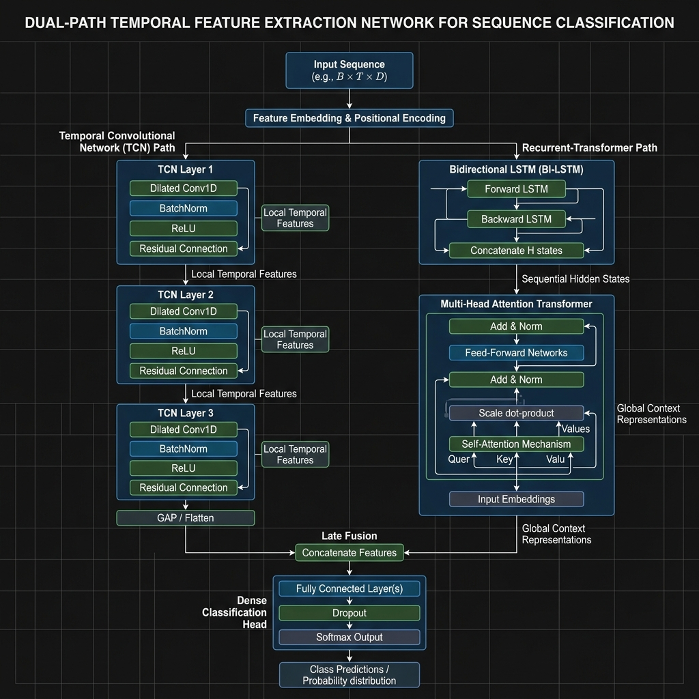

# Thesis Materials: 3.3.9 Bidirectional Long Short-Term Memory (Bi-LSTM) Sequential Layer

This document details the Bi-LSTM layer's parameters, bidirectional hidden state routing, and its specific integration as the "Trend Expert" within the Universal Hybrid ensemble.

## 1. Bi-LSTM Hyperparameters

From the `GridGuardUniversalHybrid` architecture block, the Recurrent Neural Network layer is strictly configured to analyze temporal sequencing and long-term dependencies:

*   **Input Dimension**: 2 (Feature 0: kWh, Feature 1: GLI)
*   **Hidden State Size ($h_t$)**: 64
*   **Bidirectional**: `True` (The sequence is processed both forward and backward to capture bi-causal contexts)
*   **Number of LSTM Layers**: 2 (Stacked for hierarchical feature extraction)
*   **Regularization (Dropout)**: 0.2 (Applied between the stacked LSTM layers to prevent overfitting)
*   **Batch First**: `True` (Tensors enter as `[Batch, Sequence, Feature]`)

## 2. Tensor Dimensionality Mechanics

The flow of tensors through the Bi-LSTM layer requires specific dimension concatenation because of its bidirectional nature:

1.  **Input Tensor**: The sequence tensor $\mathbf{X}$ enters the LSTM unchanged from the edge: `(Batch_Size, 26, 2)`.
2.  **Forward Pass**: The forward LSTM cell produces a sequence of hidden states of size 64.
3.  **Backward Pass**: The backward LSTM cell processes from $t=26$ to $t=0$, producing hidden states of size 64.
4.  **Concatenation**: PyTorch automatically concatenates the forward and backward states at each timestep $t$.
    *   **Bidirectional Output Dimension**: $64 \times 2 = 128$
5.  **LSTM Output Shape**: The final tensor $\mathbf{H_{LSTM}}$ exiting the recurrent layer is exactly `(Batch_Size, 26, 128)`.

## 3. Sequence Pooling Strategy & Transformer Routing

Unlike the TCN block which uses an `AdaptiveAvgPool1d` to flatten the sequence immediately, the Bi-LSTM layer **retains its sequence length**. 

Instead of pooling, the dense `(Batch_Size, 26, 128)` sequence is piped directly into the Multi-Head Attention Transformer module. The Transformer uses self-attention on this enriched sequence, and only *after* the Transformer processes it do we extract the final state (`trans_out[:, -1, :]`).

## 4. PyTorch Architecture Print Log

You can use the following mock `print(model.lstm)` console output to formally document the PyTorch instantiation in your thesis:

```text
LSTM(
  (input_size): 2
  (hidden_size): 64
  (num_layers): 2
  (bias): True
  (batch_first): True
  (dropout): 0.2
  (bidirectional): True
)
```

And the exact tensor flow from the console debugging logs:
```text
[DEBUG] Input tensor shape: torch.Size([1, 26, 2])
[DEBUG] Bi-LSTM output shape (sequence): torch.Size([1, 26, 128])
[DEBUG] Transformer input shape: torch.Size([1, 26, 128])
[DEBUG] Final Transformer state extraction: torch.Size([1, 128])
[DEBUG] Late Fusion (TCN + Trans): torch.Size([1, 192])
```

## 5. Universal Hybrid Flow Architecture

Use this highly detailed generated architecture flowchart. It visually proves how the sequence splits into the TCN path (local features) and the Bi-LSTM path (sequential features), and specifically illustrates how the Bi-LSTM feeds directly into the Transformer before the final Late Fusion concatenation.


