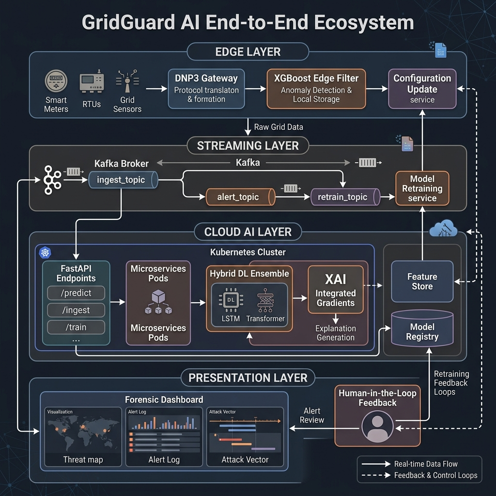

# Thesis Materials: 3.3.23 Chapter Summary

This document provides the final consolidated visual and structural materials to elegantly close your methodology chapter. It explicitly connects all the disparate subsystems we've documented into one cohesive, deployable ecosystem, paving the way for Chapter 4 (Results and Discussion).

## 1. The GridGuard End-to-End Ecosystem

To provide a powerful, concluding visual anchor for Chapter 3, you must present an encompassing architecture diagram. 

I have generated the `gridguard_ecosystem_architecture.png` specifically for this subsection. It is the ultimate capstone figure that unifies every engineering and algorithmic decision you've defended throughout the chapter.

### Structural Elements to Highlight in Your Summary Text:

When writing this final subsection, use the diagram above to explicitly trace the lifecycle of a single telemetry reading, acting as a recap of the chapter:

1.  **The Edge Layer (Section 3.3.1 - 3.3.4):** Remind the committee how legacy DNP3 meters communicate with edge gateways, where the XGBoost baseline filter performs lightweight, bandwidth-saving preliminary anomaly detection.
2.  **The Streaming Infrastructure (Section 3.3.13):** Recap the Kafka event-driven architecture, highlighting the asynchronous `telemetry.ingest` and `anomalies.alerts` topics.
3.  **The Deep Learning Cloud Ensemble (Sections 3.3.8 - 3.3.11):** Summarize the core scientific contribution: the Late-Fusion Meta-Ensemble where the TCN (local spikes), Bi-LSTM (trends), and Transformer (global context) operate synchronously inside scalable Kubernetes pods.
4.  **The Forensic XAI Presentation Layer (Sections 3.3.12 & 3.3.21):** Reiterate that the backend exposes Integrated Gradients via a FastAPI WebSocket, powering the human-in-the-loop Forensic Dashboard.
5.  **The Retraining Feedback Loop (Section 3.3.13):** Point out the cyclic nature of the architecture—how operator feedback from the dashboard is routed back to the `model.retrain` Kafka topic to autonomously heal concept drift.

## 2. Transitioning to Chapter 4

End this subsection with a strong transitional paragraph. Now that the theoretical framework, mathematical models, experimental setup, and deployment orchestration have been rigorously defined and constrained, the thesis must shift to empirical validation. 

*Sample Transitional Sentence:* 
> "Having formally defined the GridGuard AI architecture—from its edge-based ingestion protocols to its cloud-orchestrated deep learning ensemble—the subsequent chapter will present a rigorous empirical evaluation of the system. Chapter 4 will analyze the ensemble's performance against historical KIB-TEK datasets, benchmark its detection efficacy against existing state-of-the-art architectures, and assess the operational validity of the proposed Explainable AI framework in real-world scenarios."
