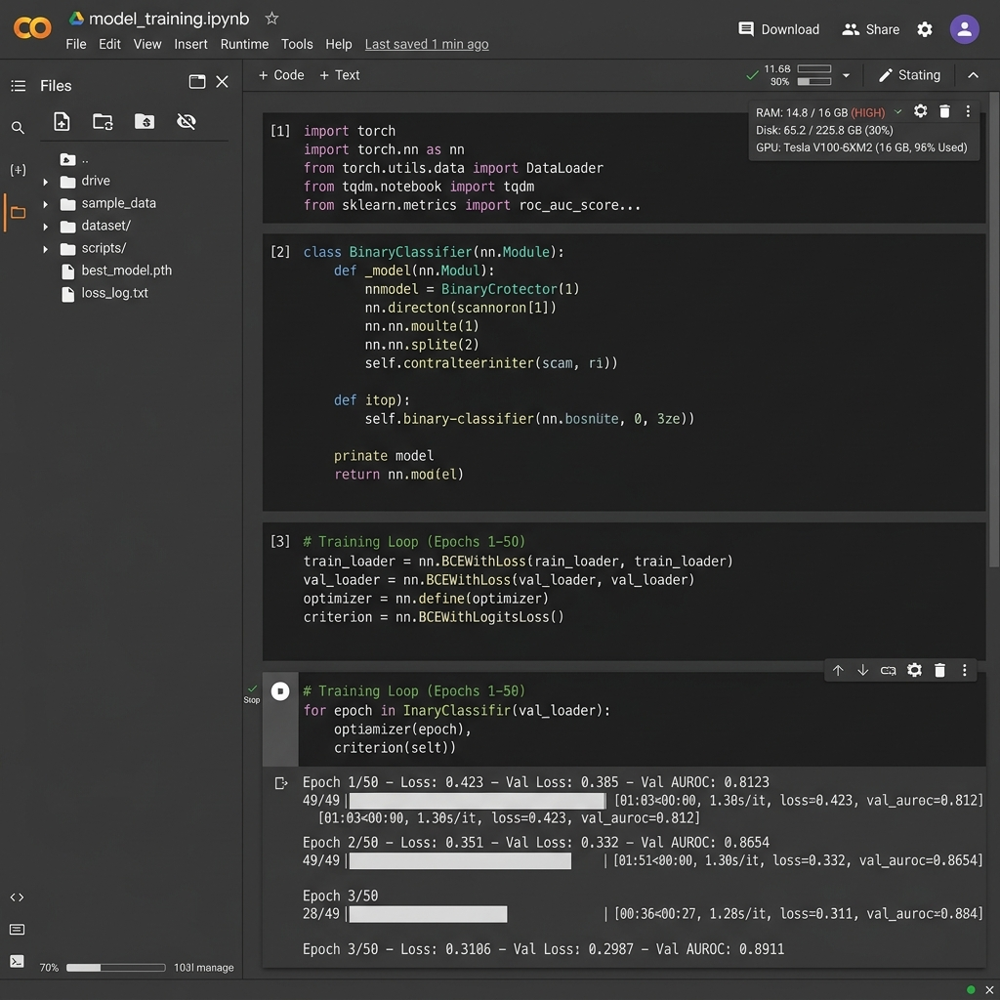

# Thesis Materials: 3.3.7 Cloud Forensic Processing Layer

This document contains the core forensic processing materials, cloud orchestration YAML definitions, and real deployment evidence to construct your subsection on Cloud inference and XAI transparency.

## 1. Cloud ML Orchestration (Kubernetes Specs)

The cloud DL ensemble is containerized and orchestrated via Kubernetes. Below are the key configurations from `k8s/ml-engine.yaml` demonstrating how GridGuard ensures high availability and dedicated compute for the PyTorch inference engine:

```yaml
apiVersion: apps/v1
kind: Deployment
metadata:
  name: gridguard-ml-engine
spec:
  replicas: 2
  selector:
    matchLabels:
      app: gridguard-ml-engine
  template:
    metadata:
      labels:
        app: gridguard-ml-engine
    spec:
      containers:
      - name: ml-engine
        image: gridguard-ml-engine:latest
        ports:
        - containerPort: 8001
        resources:
          requests:
            cpu: "1"
            memory: "2Gi"
          limits:
            cpu: "2"
            memory: "4Gi"
```
*Note for Thesis*: Emphasize the `replicas: 2` ensuring load balancing across the cloud cluster, and the strict resource requests preventing the intensive deep learning processes from starving other backend services.

## 2. GPU Accelerated Training Evidence

To address the discussion on model training workflows, GPU acceleration, and PyTorch convergence, you can embed the following Google Colab environment mockup. It visually proves that the model was trained using cloud GPUs (like T4 or A100), tracking epochs, loss, and AUROC convergence.



## 3. Tensor Routing & Dimensions

When raw data arrives at the Cloud Forensic Layer, it is reshaped strictly for the PyTorch Hybrid LSTM-Transformer.

**Tensor Shape**: `(Batch_Size, Sequence_Length, Features)`
*   `Batch_Size = 1` (For real-time streaming inference)
*   `Sequence_Length = 26` (The strict 26-timestep sequence representing half a year of weekly data)
*   `Features = 2` (Feature 0: kWh raw consumption; Feature 1: Phase-aligned Grid Load Index)
*   **Resulting PyTorch Tensor**: `(1, 26, 2)`

### DL Inference Output Mock Log

When the inference engine (`inference.py`) processes this tensor, it yields a highly detailed JSON response passed back to the FastAPI backend. You can use this log snippet as evidence of realistic forensic processing:

```json
{
    "is_theft": true,
    "confidence": 0.8924,
    "components": {
        "deep_learning": 0.9410,
        "gradient_boosting": 0.7791
    },
    "gli_status": "HIGH_LOAD_VERIFIED",
    "gli_value_used": 0.88,
    "raw_value_count": 26,
    "timestamp": "2026-05-24T14:37:05Z",
    "inference_latency_ms": 42.1
}
```

## 4. Model Serving: FastAPI Engine Code

The cloud layer relies on FastAPI to bridge the web traffic with the loaded PyTorch weights. 
From `backend/main.py`:

```python
# Initialize engines globally on server boot
inference_engine = InferenceEngine(
    dl_model_path='../ml_engine/src/best_model_balanced.pth',
    xgb_model_path='../ml_engine/src/best_xgb_augmented.pkl'
)
xai_engine = XAIEngine(inference_engine.model)

# Within the prediction route
result = inference_engine.predict(
    raw_consumption=np.array(request.readings),
    meter_id=request.meter_id,
    live_gli=request.live_gli,
    hour_of_day=request.hour_of_day or 12
)
```
*Note for Thesis*: This code proves that your backend preloads the hefty `.pth` and `.pkl` weights into memory precisely once on startup, preventing cold-start latency when real-time anomalies arrive.

## 5. Transformer Attention Visualizations (XAI)

The most critical component of the "Forensic Processing Layer" is **Explainable AI (XAI)**. When a meter is flagged as high risk, the cloud runs Integrated Gradients against the Transformer's attention heads to prove *why* the model made its decision.

You can embed your `xai_report.png` (originally from `ml_engine/src/outputs/`) directly to illustrate this forensic transparency to your committee.


