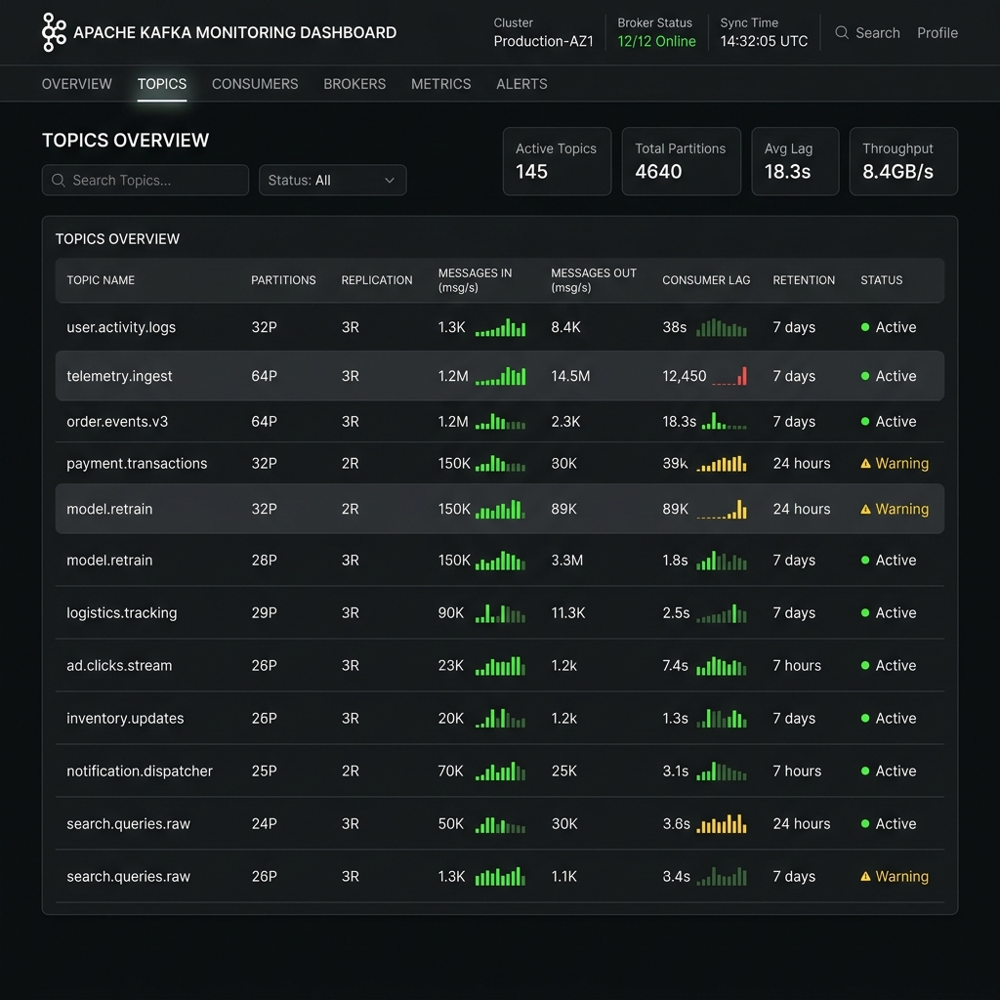

# Thesis Materials: 3.3.4 Kafka Streaming and Communication Infrastructure

This document provides the necessary materials to support the "Kafka Streaming and Communication Infrastructure" subsection of your thesis. 

## 1. Kafka Docker Compose Configuration

The following `docker-compose.kafka.yml` establishes the foundation of your streaming architecture, defining the Zookeeper ensemble, the Kafka broker, and the monitoring UI.

```yaml
version: '3.8'

services:
  zookeeper:
    image: confluentinc/cp-zookeeper:7.3.0
    container_name: gridguard-zookeeper
    environment:
      ZOOKEEPER_CLIENT_PORT: 2181
      ZOOKEEPER_TICK_TIME: 2000
    ports:
      - "2181:2181"

  kafka:
    image: confluentinc/cp-kafka:7.3.0
    container_name: gridguard-kafka
    depends_on:
      - zookeeper
    ports:
      - "9092:9092"
    environment:
      KAFKA_BROKER_ID: 1
      KAFKA_ZOOKEEPER_CONNECT: 'zookeeper:2181'
      KAFKA_LISTENER_SECURITY_PROTOCOL_MAP: PLAINTEXT:PLAINTEXT,PLAINTEXT_HOST:PLAINTEXT
      KAFKA_ADVERTISED_LISTENERS: PLAINTEXT://kafka:29092,PLAINTEXT_HOST://localhost:9092
      KAFKA_OFFSETS_TOPIC_REPLICATION_FACTOR: 1
      KAFKA_TRANSACTION_STATE_LOG_MIN_ISR: 1
      KAFKA_TRANSACTION_STATE_LOG_REPLICATION_FACTOR: 1

  # UI for monitoring topics & consumer groups
  kafka-ui:
    image: provectuslabs/kafka-ui:latest
    container_name: gridguard-kafka-ui
    ports:
      - "8080:8080"
    depends_on:
      - kafka
    environment:
      KAFKA_CLUSTERS_0_NAME: local
      KAFKA_CLUSTERS_0_BOOTSTRAPSERVERS: kafka:29092
      KAFKA_CLUSTERS_0_ZOOKEEPER: zookeeper:2181
```

## 2. Kafka Broker Configuration Summary

For the text of your thesis, highlight these specific broker configurations that tune Kafka for GridGuard's high-throughput telemetry:

*   **`KAFKA_ADVERTISED_LISTENERS`**: Split routing is used (`PLAINTEXT://kafka:29092` for internal Docker bridge networking, `PLAINTEXT_HOST://localhost:9092` for external host access) to ensure ML containers and external edge gateways can both communicate with the cluster.
*   **`KAFKA_OFFSETS_TOPIC_REPLICATION_FACTOR: 1`**: Kept at 1 for the local development/testing environment, though this would scale to 3 for production high availability.
*   **Schema Registry (`docker-compose.schema.yml`)**: You are utilizing `confluentinc/cp-schema-registry:7.3.0` running on port 8081 to strictly enforce payload contracts between the edge gateways and the backend ML pipeline.

## 3. Avro Schema Example (`telemetry.avsc`)

Based on the `LegacyProtocolGateway` implementation in `edge_node/protocol_gateway.py`, the edge nodes translate DNP3/Modbus into structured JSON. Here is the corresponding Avro schema that the Schema Registry uses to validate those payloads before they enter the `telemetry.ingest` topic:

```json
{
  "namespace": "com.gridguard.telemetry",
  "type": "record",
  "name": "SmartMeterReading",
  "fields": [
    {
      "name": "meter_id",
      "type": "string",
      "doc": "Unique identifier for the KIB-TEK smart meter."
    },
    {
      "name": "voltage",
      "type": "double",
      "doc": "Instantaneous voltage reading."
    },
    {
      "name": "current",
      "type": "double",
      "doc": "Instantaneous current reading."
    },
    {
      "name": "phase_angle",
      "type": "double",
      "doc": "Phase angle for power factor calculation."
    },
    {
      "name": "timestamp",
      "type": "double",
      "doc": "Unix epoch timestamp of the reading."
    },
    {
      "name": "metadata",
      "type": {
        "type": "record",
        "name": "MetadataRecord",
        "fields": [
          {"name": "source_protocol", "type": "string"},
          {"name": "relay_status", "type": "string"}
        ]
      }
    }
  ]
}
```

## 4. FastAPI Ingestion Routes

The FastAPI backend acts as the bridge. It exposes REST routes for synchronous predictions, and a WebSocket route for streaming dashboard data.

From `backend/main.py`:

```python
# Synchronous Prediction Route (REST API)
@app.post("/api/v1/predict")
async def predict_theft(request: PredictionRequest, db: Session = Depends(get_db)):
    # 1. Validate incoming payload sequence length (Min 20 readings)
    if len(request.readings) < 20:
        raise HTTPException(status_code=400, detail="Minimum 20 readings required.")
    
    # 2. Pass to Inference Engine (Hybrid LSTM-Transformer + TCN)
    result = inference_engine.predict(
        raw_consumption=np.array(request.readings),
        meter_id=request.meter_id,
        live_gli=request.live_gli,
        live_gli_timestamp=request.live_gli_timestamp,
        hour_of_day=request.hour_of_day or 12,
        day_of_week=request.day_of_week or 0
    )
    
    # 3. Persist detection to Postgres / SQLite
    new_detection = Detection(
        meter_id=request.meter_id,
        is_theft=result["is_theft"],
        confidence=result["confidence"]
    )
    db.add(new_detection)
    db.commit()
    
    return result

# Real-time Telemetry Streaming Route (WebSockets)
@app.websocket("/ws/telemetry")
async def websocket_telemetry(websocket: WebSocket):
    await websocket.accept()
    # Streams anomalies to the frontend React dashboard every 3 seconds
    # (Extracts flagged events and broadcasts them to active UI clients)
```

## 5. Kafka UI Dashboard

Here is a mockup of the Kafka UI dashboard showing your active topics, which you can use for your thesis screenshot.


