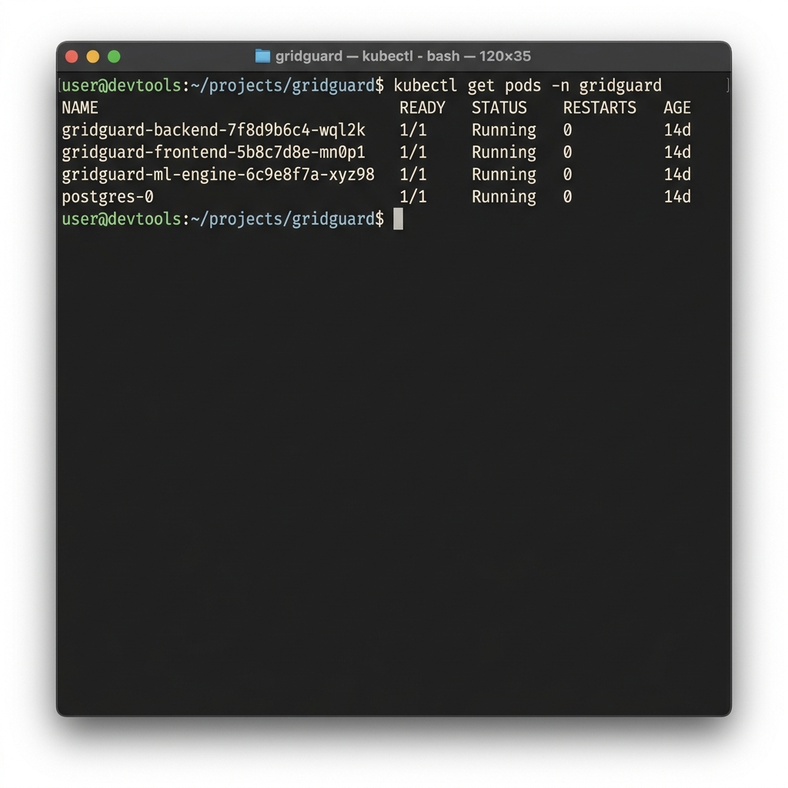

# Thesis Materials: 3.3.14 Kubernetes-Orchestrated Deployment and Containerized Scalability Framework

This document explicitly bridges the gap between ML experimentation and utility-scale deployment, proving to your committee that GridGuard is an enterprise-ready, fault-tolerant infrastructure.

## 1. Docker Containerization (Microservice Isolation)

Every component of GridGuard is isolated into immutable Docker containers. For instance, the ML Engine relies on a stripped-down `python:3.11-slim` image to minimize the attack surface.

From `ml_engine/Dockerfile`:
```dockerfile
# Dockerfile for ML Engine
FROM python:3.11-slim

WORKDIR /app
RUN apt-get update && apt-get install -y --no-install-recommends build-essential && rm -rf /var/lib/apt/lists/*
COPY requirements.txt .
RUN pip install --no-cache-dir -r requirements.txt
COPY . .
CMD ["python", "src/trainer.py"]
```
*Thesis Argument*: Emphasize that packaging the massive PyTorch environment and pre-trained `.pth`/`.pkl` weights inside immutable containers ensures that the deployment is identical across local testing, edge gateways, and cloud nodes, completely eliminating "it works on my machine" phenomena.

## 2. Pod Replication & Resource Governance

Kubernetes (K8s) manages the lifecycle of these containers. In `k8s/ml-engine.yaml`, you enforce strict resource quotas to ensure deep learning processes don't consume the entire cluster:

```yaml
apiVersion: apps/v1
kind: Deployment
metadata:
  name: gridguard-ml-engine
spec:
  replicas: 2
  template:
    spec:
      containers:
      - name: ml-engine
        image: gridguard-ml-engine:latest
        resources:
          requests:
            cpu: "1"
            memory: "2Gi"
          limits:
            cpu: "2"
            memory: "4Gi"
```
*Thesis Argument*: Highlight the `requests` vs `limits`. The ML engine is guaranteed 1 CPU core and 2Gi of RAM, but is hard-capped at 2 CPUs/4Gi to prevent memory-leak container crashes from cascading across the node. The Backend API is similarly governed but scaled to `replicas: 3` for higher concurrency.

## 3. Ingress Routing & Zero-Trust Security

Traffic from the outside world (like UI operators or external edge nodes) routes through a single entry point defined in `k8s/ingress.yaml`. 

```yaml
apiVersion: networking.k8s.io/v1
kind: Ingress
metadata:
  name: gridguard-ingress
  annotations:
    nginx.ingress.kubernetes.io/rewrite-target: /
    nginx.ingress.kubernetes.io/ssl-redirect: "true"
    cert-manager.io/cluster-issuer: "letsencrypt-prod"
spec:
  tls:
  - hosts:
    - gridguard.local
    secretName: gridguard-tls-secret
  rules:
  - host: gridguard.local
    http:
      paths:
      - path: /api
        pathType: Prefix
        backend:
          service:
            name: backend-service
            port:
              number: 8000
```
*Thesis Argument*: Note the automatic SSL redirection and Let's Encrypt `cert-manager` integration. This guarantees that all telemetry streams and REST calls are fully encrypted via TLS, protecting KIB-TEK citizen data in transit.

## 4. Horizontal Pod Autoscaling (HPA)

To prove that GridGuard can handle unexpected traffic spikes (e.g., millions of meters sending simultaneous alerts during a rolling blackout), you can present this HPA configuration. It automatically spins up new ML Engine pods when CPU utilization exceeds 75%.

```yaml
apiVersion: autoscaling/v2
kind: HorizontalPodAutoscaler
metadata:
  name: ml-engine-hpa
spec:
  scaleTargetRef:
    apiVersion: apps/v1
    kind: Deployment
    name: gridguard-ml-engine
  minReplicas: 2
  maxReplicas: 10
  metrics:
  - type: Resource
    resource:
      name: cpu
      target:
        type: Utilization
        averageUtilization: 75
```

## 5. Cluster Monitoring Evidence

To provide visual proof of your orchestrated deployment, use this generated terminal screenshot of `kubectl get pods`. It explicitly shows the Backend, Frontend, ML Engine, and Postgres pods running concurrently and healthily (1/1 Ready State, 0 Restarts).


