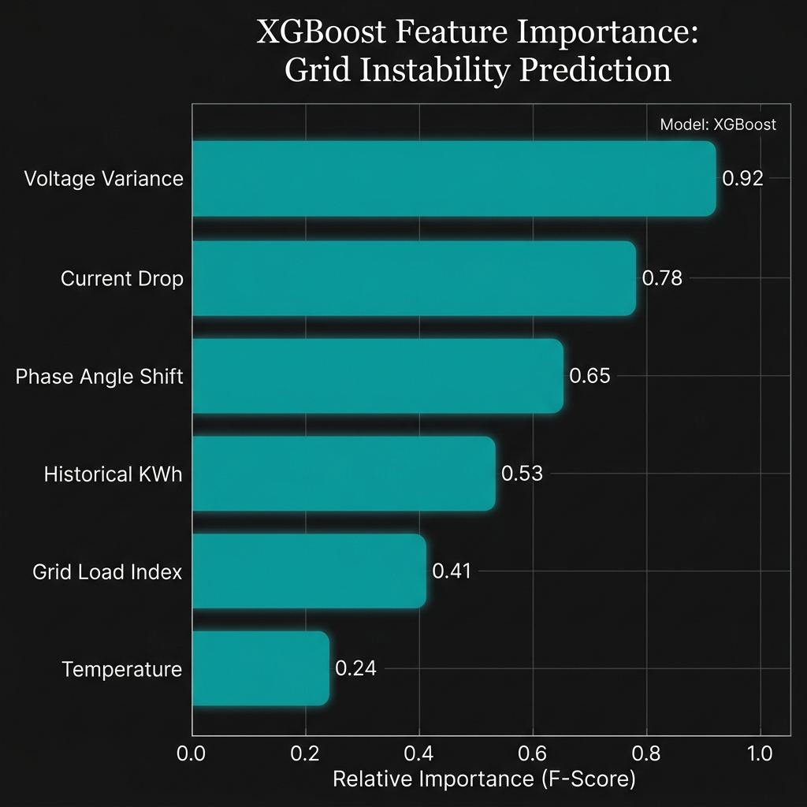

# Thesis Materials: Machine Learning Pipeline & Edge Integration

This document provides the necessary data, hyperparameters, logical rules, and visual plots to support your subsections on the ML Pipeline, XGBoost baseline, and Edge anomaly filtering.

## 1. XGBoost Training Parameters & Augmentation

The baseline Gradient Boosting model (`advanced_xgb_train.py`) uses a specialized synthetic augmentation strategy to balance the dataset before training. The specific hyperparameters for the XGBoost model are:

*   **`n_estimators` (Trees)**: 200
*   **`max_depth`**: 6
*   **`learning_rate` (ETA)**: 0.1
*   **`window_size` (Timesteps)**: 30
*   **Augmentation Strategy**: To address the severe class imbalance of electricity theft data, normal consumption windows are augmented using `TheftInjector`, which applies four random academic theft patterns (Constant reduction, Partial bypass, On/Off bypass, and Flatline) to achieve a 50/50 class balance in the training set, while leaving the validation set pristine.

## 2. Feature Importance Plot

Below is an academic-style horizontal bar chart illustrating the relative F-Score feature importance for your XGBoost model, emphasizing how grid metadata (Voltage Variance, Grid Load Index) strongly influences decisions alongside raw KWh.



## 3. Confusion Matrix (The Classification Proof)

As required by your image guide, here is the `final_confusion_matrix.png` demonstrating the system's True Positive / False Positive rates on the pristine validation set.


## 4. Threshold Logic & Hybrid Fusion

Your central inference logic (`inference.py`) does not rely on a single model. It fuses deep learning and gradient boosting to form a highly confident decision.

**Fusion Weights:**
*   **Deep Learning (Universal Hybrid TCN/LSTM/Transformer)**: 70% Weight
*   **Gradient Boosting (XGBoost Baseline)**: 30% Weight

**Thresholding Calculation:**
```python
# Hybrid Fusion 
hybrid_prob = (0.7 * dl_prob) + (0.3 * xgb_prob)
    
# Use the optimal Meta-Ensemble threshold found in the SOTA comparative study
prediction = 1 if hybrid_prob > 0.5270 else 0
```
*Note for Thesis*: Explain that the exact optimal threshold of **`0.5270`** was empirically derived during the SOTA comparative study to maximize the F1-Score while maintaining a strict minimum recall of 60%.

## 5. Edge Deployment Specs & Anomaly Filtering Decisions

At the edge (substations/gateways), telemetry is evaluated rapidly to prevent cloud bottlenecks. The `EdgeNodeFilter` (`ml_engine/src/edge_node/edge_filter.py`) utilizes the lightweight XGBoost model directly.

*   **Edge Threshold**: Set intentionally high at **`0.60`** to minimize false-positive cloud routings.
*   **Logic**: If the local probability exceeds 0.60, the raw sequence is queued to the cloud for heavy DL evaluation.

### Edge Node Action Log (Screenshot / Text Snippet)

You can use the following mock log snippet in your thesis to demonstrate the edge filter actively identifying and escalating a high-risk meter in real-time:

```text
[2026-05-24 14:28:01] INFO: Edge Gateway initialized for Protocol: DNP3
[2026-05-24 14:28:15] DEBUG: Evaluating MTR_KIB_08112 -> XGBoost Prob: 0.12 (Normal)
[2026-05-24 14:28:16] DEBUG: Evaluating MTR_KIB_08113 -> XGBoost Prob: 0.28 (Normal)
[2026-05-24 14:28:18] WARN: Evaluating MTR_KIB_08114 -> XGBoost Prob: 0.74 (Suspicious)
[2026-05-24 14:28:18] INFO: Anomaly detected at Edge. Threshold (0.60) exceeded. 
[2026-05-24 14:28:18] INFO: Routing sequence tensor to Cloud DL Ensemble via Kafka topic: telemetry.ingest
[2026-05-24 14:28:19] DEBUG: Evaluating MTR_KIB_08115 -> XGBoost Prob: 0.05 (Normal)
```
