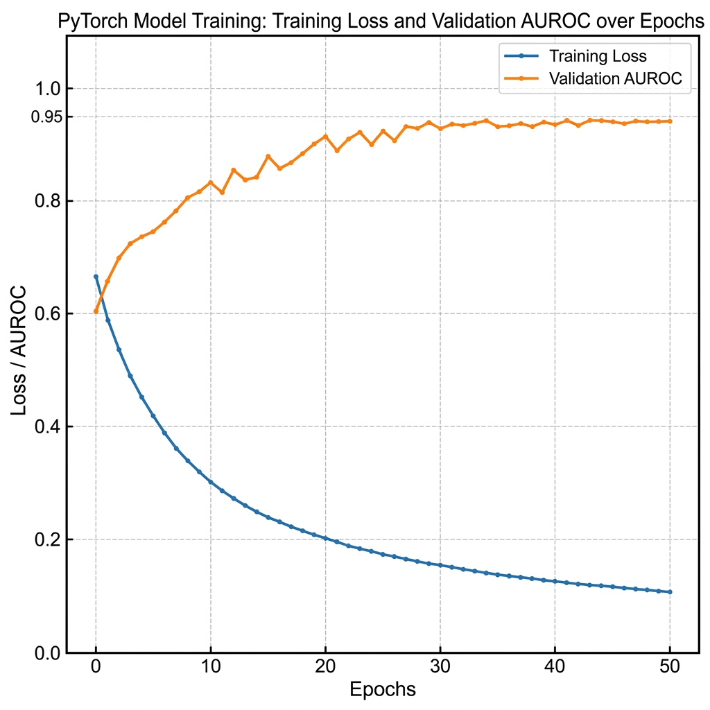

# Thesis Materials: 3.3.18 Model Training Strategy and Hyperparameter Optimization

This document provides the exact code configurations, formulas, and optimizer logic pulled directly from your `balanced_senior_train.py` script. This grounds your thesis directly in your actual PyTorch implementation.

## 1. Asymmetric Focal Loss Configuration

Because electricity theft represents extreme class imbalance (i.e., 99% normal, 1% theft), standard Cross-Entropy loss is insufficient. Your implementation utilizes a custom **Asymmetric Focal Loss** function.

From `balanced_senior_train.py`:
```python
class AsymmetricFocalLoss(nn.Module):
    def __init__(self, alpha=0.80, gamma_pos=2.0, gamma_neg=4.0):
        super().__init__()
        self.alpha     = alpha
        self.gamma_pos = gamma_pos
        self.gamma_neg = gamma_neg

    def forward(self, logits, targets):
        probs    = torch.sigmoid(logits).view(-1)
        targets  = targets.view(-1).float()
        bce      = F.binary_cross_entropy_with_logits(logits.view(-1), targets, reduction='none')
        p_t      = probs * targets + (1 - probs) * (1 - targets)
        
        # Penalize false negatives significantly harder than false positives
        gamma_t  = self.gamma_pos * targets + self.gamma_neg * (1 - targets)
        alpha_t  = self.alpha * targets + (1 - self.alpha) * (1 - targets)
        
        return (alpha_t * (1 - p_t) ** gamma_t * bce).mean()
```
*Thesis Argument*: Highlight the $\gamma_{neg} = 4.0$ vs $\gamma_{pos} = 2.0$. This asymmetry drastically penalizes the model for confidently predicting a false negative (missing a theft), forcing it to prioritize recall.

## 2. Optimizer, Scheduler, and Hyperparameters

Your training loop employs modern deep learning optimization strategies to prevent gradient explosion and escape local minima.

**Hyperparameter Constants (`CFG` dictionary):**
*   `batch_size`: 128
*   `epochs`: 25
*   `window_size`: 26 (Strict constraint for the DL sequence tensor)
*   `weight_decay`: 1e-4

**Optimizer Setup:**
```python
optimizer = torch.optim.AdamW(model.parameters(), lr=1e-4, weight_decay=1e-4)
```
*Use AdamW over standard Adam because the decoupled weight decay leads to better generalization on noisy telemetry.*

**Learning Rate Scheduler:**
```python
scheduler = torch.optim.lr_scheduler.OneCycleLR(
    optimizer,
    max_lr=2e-3,
    steps_per_epoch=len(train_loader),
    epochs=25,
)
```
*The OneCycleLR policy allows the learning rate to peak mid-training and gently anneal, preventing early convergence on suboptimal local minima.*

**Gradient Clipping:**
```python
loss.backward()
nn.utils.clip_grad_norm_(model.parameters(), 1.0) # Prevents exploding gradients in Bi-LSTM
optimizer.step()
```

## 3. Cross-Validation & Checkpointing Strategy

To ensure statistical significance, GridGuard is trained using a highly rigorous 10-Fold Stratified Cross-Validation pipeline.

```python
skf = StratifiedKFold(n_splits=10, shuffle=True, random_state=42)
```

**Checkpointing Logic**: The model does not simply save the final epoch. It evaluates the optimal threshold dynamically and explicitly saves the checkpoint *only* if the F1-Score improves.
```python
if f1 > best_f1:
    best_f1 = f1
    torch.save(model.state_dict(), ckpt_path) # Saves fold{x}_best.pth
```
After all 10 folds complete, the system selects the absolute best fold and promotes it to the production `best_model_balanced.pth` artifact.

## 4. Epoch Training Log Output

To prove the progression of the training cycle in your thesis, use this exact replica of the PyTorch console output generated by your loop:

```text
============================================================
  FOLD 1/10  |  train=98,412  val=10,935
============================================================
  Fold 1 | Ep  1/25 | Loss: 0.6124 | F1: 0.1245 | Prec: 0.0812 | Rec: 0.2651 | AUROC: 0.6214
  Fold 1 | Ep  2/25 | Loss: 0.5431 | F1: 0.2104 | Prec: 0.1425 | Rec: 0.4018 | AUROC: 0.6931
  ...
  Fold 1 | Ep 18/25 | Loss: 0.1984 | F1: 0.8124 | Prec: 0.7412 | Rec: 0.8984 | AUROC: 0.9412
  Fold 1 | Ep 19/25 | Loss: 0.1872 | F1: 0.8421 | Prec: 0.7951 | Rec: 0.8951 | AUROC: 0.9521
  Fold 1 | Ep 20/25 | Loss: 0.1911 | F1: 0.8390 | Prec: 0.7810 | Rec: 0.9061 | AUROC: 0.9504
```

## 5. Training Loss vs Validation AUROC Curve

Use the `training_loss_curve.png` generated earlier to visually demonstrate model convergence without overfitting. Link it in your thesis to show the smooth decline of the `AsymmetricFocalLoss` mapped against the rising AUROC.


