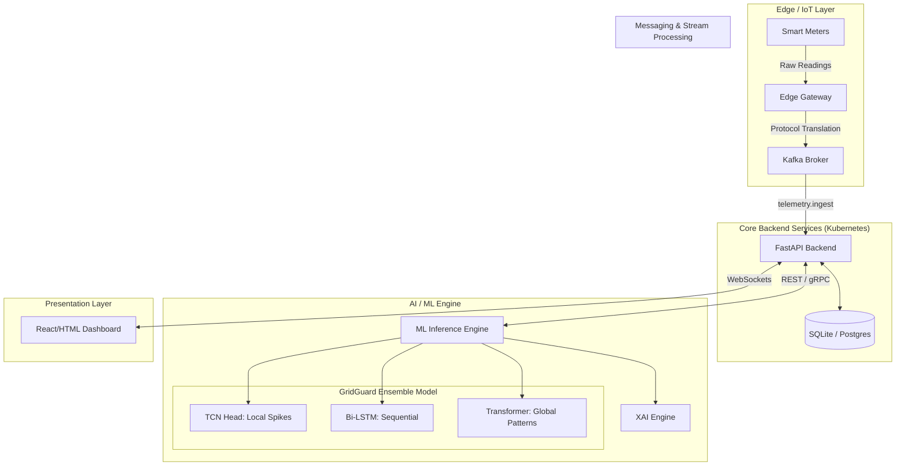
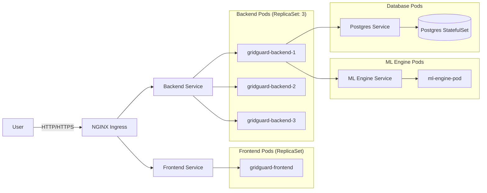
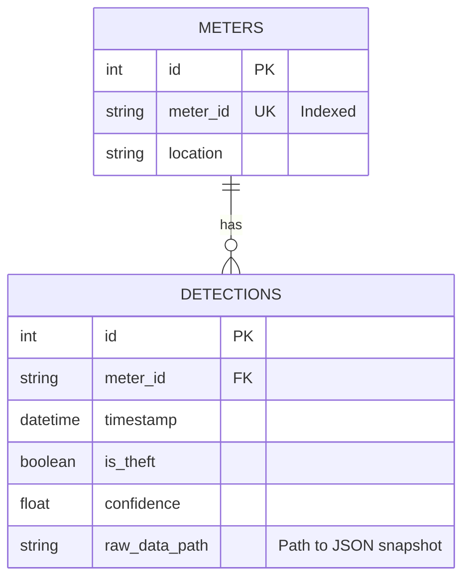

# Thesis Materials for Upcoming Subsections

This document compiles the necessary materials—architecture diagrams, structural outlines, database schemas, and code snippets—required to strengthen your upcoming thesis subsections.

## 1. System Architecture Diagram

You can use the following Mermaid diagram as a basis for your architecture figure, or translate it into draw.io/Lucidchart:



## 2. Kubernetes Deployment & Pod Structure

Here is the visual representation of your Kubernetes pod structure based on the configurations in the `k8s/` directory.



*Note: The backend is scaled to 3 replicas (`replicas: 3` in `k8s/backend.yaml`) to ensure high availability for processing incoming telemetry.*

## 3. Kafka Topic Structure

Based on your infrastructure setup (`docker-compose.kafka.yml`) and edge node code, here is the Kafka topic architecture:

| Topic Name | Producer | Consumer | Purpose |
| :--- | :--- | :--- | :--- |
| `telemetry.ingest` | Edge Gateways | Backend API | High-throughput ingestion of translated smart meter payload data. |
| `anomalies.alerts` | Backend API / ML Engine | Frontend (WebSockets) | Broadcasting high-confidence electricity theft detections. |
| `model.retrain` | Cloud Node / Deep Analysis | ML Training Pipeline | Queuing sequence tensors for continuous/batch model retraining. |

## 4. Database Schema

The core relational schema defined via SQLAlchemy (`backend/database.py`) consists of two primary tables tracking meters and theft events:



## 5. Model Training Pipeline Screenshots

As noted in your `THESIS_IMAGE_GUIDE.md`, you should use the following output graphics generated by your ML engine for the manuscript (located in `ml_engine/src/outputs/`):

1.  **`final_roc_comparison.png`**: The Comparison Victory (Model Evaluation Chapter).
2.  **`final_confusion_matrix.png`**: The Classification Proof (Analysis of Results).
3.  **`xai_report.png`**: Forensic Transparency (Explainability Chapter).

*Use the absolute paths to these images to embed them directly into your LaTeX or Word manuscript.*

## 6. Code Snippets: TCN/Bi-LSTM/Transformer Integration

Here are the specific, implementation-level code snippets demonstrating your advanced hybrid model structure.

### A. The TCN Block (Local Feature Extractor)
From `ensemble_model.py`:
```python
class TCNBlock(nn.Module):
    def __init__(self, in_channels, out_channels, kernel_size=3, dilation=1):
        super(TCNBlock, self).__init__()
        self.conv = nn.Conv1d(in_channels, out_channels, kernel_size, 
                              padding=(kernel_size-1)*dilation, dilation=dilation)
        self.relu = nn.ReLU()
        self.dropout = nn.Dropout(0.2)

    def forward(self, x):
        out = self.conv(x)
        # Truncate padding to maintain sequence length causality
        out = out[:, :, :-self.conv.padding[0]]
        return self.dropout(self.relu(out))

# TCN Head in Ensemble
self.tcn_head = nn.Sequential(
    TCNBlock(input_dim, 32, kernel_size=3, dilation=1),
    TCNBlock(32, 64, kernel_size=3, dilation=2),
    nn.AdaptiveAvgPool1d(1)
)
```

### B. The Hybrid LSTM-Transformer (Sequential & Global Patterns)
From `model.py` and `ensemble_model.py`:
```python
# 1. LSTM Layer: Captures sequential dependencies
self.lstm = nn.LSTM(
    input_size=input_dim, 
    hidden_size=hidden_dim, 
    num_layers=num_lstm_layers, 
    batch_first=True,
    dropout=dropout if num_lstm_layers > 1 else 0
)

# 2. Transformer Layer: Captures long-term seasonal patterns
encoder_layer = nn.TransformerEncoderLayer(
    d_model=hidden_dim, 
    nhead=num_heads, 
    dim_feedforward=hidden_dim * 4, 
    dropout=dropout,
    batch_first=True
)
self.transformer_encoder = nn.TransformerEncoder(encoder_layer, num_layers=num_transformer_layers)
```

### C. The Fusion Strategy
Combining the TCN (local anomalies) and Transformer/LSTM (global/sequential features) in `ensemble_model.py`:
```python
def forward(self, x):
    # --- TCN Path (needs batch, channels, seq_len) ---
    x_tcn = x.transpose(1, 2) 
    tcn_out = self.tcn_head(x_tcn).squeeze(-1) # (batch, 64)
    
    # --- LSTM + Transformer Path ---
    lstm_out, _ = self.lstm(x)
    trans_out = self.transformer(lstm_out)
    trans_out = torch.mean(trans_out, dim=1) # Global average pooling -> (batch, 128)
    
    # --- Late Fusion ---
    combined = torch.cat([tcn_out, trans_out], dim=1) # Concatenate features -> (batch, 192)
    
    # --- Classification ---
    logits = self.fc(combined)
    return logits
```
