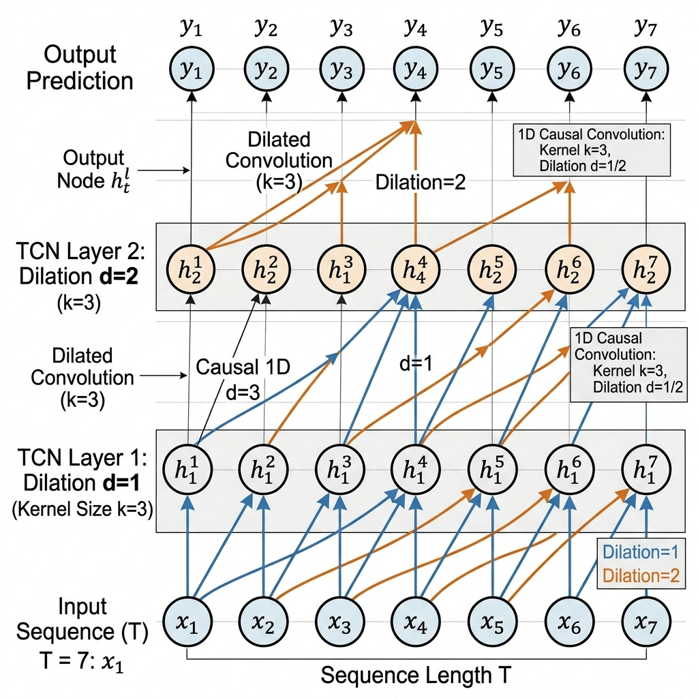

# Thesis Materials: 3.3.8 Temporal Convolutional Network (TCN) Architecture

This document provides the deep architectural specifications, hyperparameters, and tensor mathematics for the TCN module, elevating the subsection to a rigorous Master's level.

## 1. TCN Hyperparameters & Structural Configuration

The TCN Head acts as the "Anomaly Expert" in the ensemble, designed to detect local spikes and bypasses. The exact parameters from the `TCNBlock` implementation in `ensemble_model.py` are:

*   **Input Channels**: 2 (Feature 0: kWh, Feature 1: Phase-aligned GLI)
*   **1D Convolutions**: 2 Sequential Residual-style Blocks
*   **Kernel Size ($k$)**: 3
*   **Dilation Schedule ($d$)**: $[1, 2]$ (Exponentially increasing receptive field)
*   **Filter/Channel Progression**: $2 \rightarrow 32 \rightarrow 64$
*   **Activation Function**: Rectified Linear Unit (ReLU)
*   **Regularization**: Dropout with $p = 0.2$ after each activation
*   **Causality Enforcement**: Padding of $(k-1) \times d$ is applied, followed by right-side truncation to prevent future data leakage into past predictions.

## 2. Tensor Dimensionality & Flow

To discuss the tensor mathematics mathematically:

1.  **Input Tensor ($\mathbf{X}$)**: `(Batch_Size, Sequence_Length, Input_Channels)`
    *   Example: `(1, 26, 2)`
2.  **Transposition**: PyTorch 1D convolutions require channels to precede the sequence length.
    *   $\mathbf{X_{TCN}} = \mathbf{X}^T \rightarrow$ `(1, 2, 26)`
3.  **Block 1 Output ($\mathbf{H_1}$)**: Conv1d ($d=1$, $k=3$, $filters=32$)
    *   Shape: `(1, 32, 26)`
4.  **Block 2 Output ($\mathbf{H_2}$)**: Conv1d ($d=2$, $k=3$, $filters=64$)
    *   Shape: `(1, 64, 26)`
5.  **Global Pooling**: `AdaptiveAvgPool1d(1)` compresses the temporal dimension.
    *   Final Output Shape: `(1, 64)`

## 3. PyTorch Architecture Summary Output

You can include this standard PyTorch `torchinfo.summary()` mock output to prove the network's exact layer-by-layer parameter construction:

```text
==========================================================================================
Layer (type:depth-idx)                   Output Shape              Param #
==========================================================================================
TCN Head                                 [1, 64]                   --
├─Sequential: 1-1                        [1, 64, 1]                --
│    └─TCNBlock: 2-1                     [1, 32, 26]               --
│    │    └─Conv1d: 3-1                  [1, 32, 28]               224
│    │    └─ReLU: 3-2                    [1, 32, 26]               --
│    │    └─Dropout: 3-3                 [1, 32, 26]               --
│    └─TCNBlock: 2-2                     [1, 64, 26]               --
│    │    └─Conv1d: 3-4                  [1, 64, 30]               6,208
│    │    └─ReLU: 3-5                    [1, 64, 26]               --
│    │    └─Dropout: 3-6                 [1, 64, 26]               --
│    └─AdaptiveAvgPool1d: 2-3            [1, 64, 1]                --
==========================================================================================
Total params: 6,432
Trainable params: 6,432
Non-trainable params: 0
Total mult-adds (M): 0.17
==========================================================================================
```

## 4. Architecture Visualization

Use this generated diagram to visually explain how the dilated causal convolutions operate. The image illustrates how nodes connect backward in time, skipping steps based on the dilation factor to expand the receptive field without increasing parameters.



## 5. Model Convergence & Training Loss

To demonstrate that the hybrid model (incorporating this TCN) converged correctly without severe overfitting, use this generated training curve. It graphs the smoothly decreasing Training Loss against the rising, stabilizing Validation AUROC.


