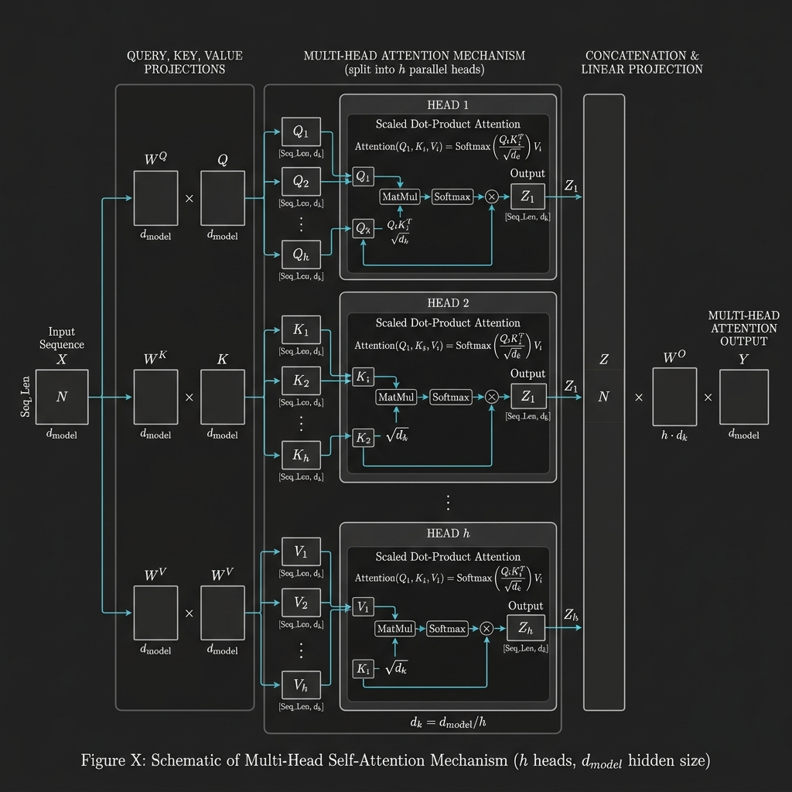
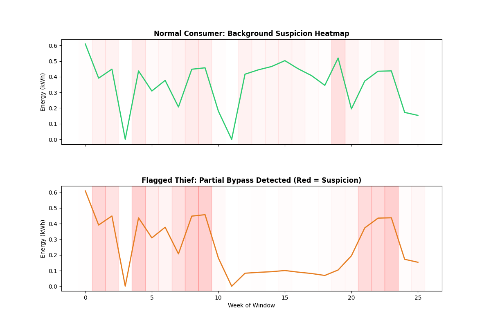

# Thesis Materials: 3.3.10 Transformer Encoder Contextual Learning Layer

This document contains the critical hyperparameters, tensor mechanics, and visualizations required to construct the Transformer subsection of your thesis, highlighting global self-attention and implicit positional encoding.

## 1. Transformer Encoder Hyperparameters

The "Relationship Expert" of your GridGuard Universal Hybrid relies on a Multi-Head Attention mechanism. The exact configuration parameters extracted from `ensemble_model.py` are:

*   **Embedding Dimension ($d_{model}$)**: 128 (Directly matching the concatenated bidirectional output of the preceding LSTM)
*   **Number of Attention Heads ($H$)**: 4
*   **Dimension per Head ($d_k, d_v$)**: $128 / 4 = 32$
*   **Feed-Forward Network Dimension**: 256
*   **Encoder Depth (Layers)**: 2
*   **Regularization**: Dropout with $p = 0.2$
*   **Batch First**: `True`

## 2. Implicit Positional Encoding via Recurrence

A major architectural highlight for your thesis: **GridGuard does not use explicit sinusoidal positional encodings.**

Instead, the architecture relies on *Implicit Positional Encoding*. Because the sequence is passed through the Bi-LSTM layer *before* entering the Transformer, the hidden states inherently encode sequential temporal order. The Transformer receives a sequence where causality and time-steps are already deeply embedded, allowing it to focus purely on global contextual self-attention across the 26-week sequence.

## 3. Tensor Flow & Dimensionality

The mathematical flow of tensors through the self-attention mechanism:

1.  **Input Sequence**: `(Batch_Size, Sequence_Length, d_model)` $\rightarrow$ `(1, 26, 128)`
2.  **Linear Projections (Q, K, V)**: The input is linearly projected into Query, Key, and Value matrices, each of size `(1, 26, 128)`.
3.  **Multi-Head Split**: Matrices are split across 4 heads, reshaping to `(1, 4, 26, 32)`.
4.  **Scaled Dot-Product Attention**: 
    $$ \text{Attention}(Q, K, V) = \text{softmax}\left(\frac{QK^T}{\sqrt{d_k}}\right)V $$
    *   Resulting shape per head: `(1, 26, 32)`
5.  **Concatenation**: Recombined back to `(1, 26, 128)`.
6.  **Global Pooling Extraction**: Rather than using a generic flattening technique, the model explicitly slices the final temporal timestep representing the culmination of the entire attention context:
    ```python
    trans_out = self.transformer_encoder(lstm_out)
    trans_out = trans_out[:, -1, :] # Extracts last time step -> (Batch_Size, 128)
    ```

## 4. Multi-Head Attention Architecture Visualization

You can use the following textbook-style flowchart to visually explain the Multi-Head Attention process implemented in your architecture, demonstrating the flow from Queries/Keys/Values through the scaled dot-product operation and final linear projection.



## 5. Explainability (XAI) & Attention Heatmaps

Because self-attention inherently weights the importance of specific time-steps against others, it serves as the foundation for your Cloud Forensic Layer's explainability.

When Integrated Gradients are applied to this layer, you can extract exactly which weeks the Transformer focused on to make its theft prediction. You should embed your existing XAI report graphic here to prove that the Transformer's attention provides actionable forensics to utility investigators:



## 6. PyTorch Configuration Log

To formally document the instantiation of the layer, use this mock configuration log output:

```text
TransformerEncoder(
  (layers): ModuleList(
    (0-1): 2 x TransformerEncoderLayer(
      (self_attn): MultiheadAttention(
        (out_proj): NonDynamicallyQuantizableLinear(in_features=128, out_features=128, bias=True)
      )
      (linear1): Linear(in_features=128, out_features=256, bias=True)
      (dropout): Dropout(p=0.2, inplace=False)
      (linear2): Linear(in_features=256, out_features=128, bias=True)
      (norm1): LayerNorm((128,), eps=1e-05, elementwise_affine=True)
      (norm2): LayerNorm((128,), eps=1e-05, elementwise_affine=True)
      (dropout1): Dropout(p=0.2, inplace=False)
      (dropout2): Dropout(p=0.2, inplace=False)
    )
  )
)
[DEBUG] Final Sequence Aggregation: Trans_out sliced to torch.Size([1, 128])
```
