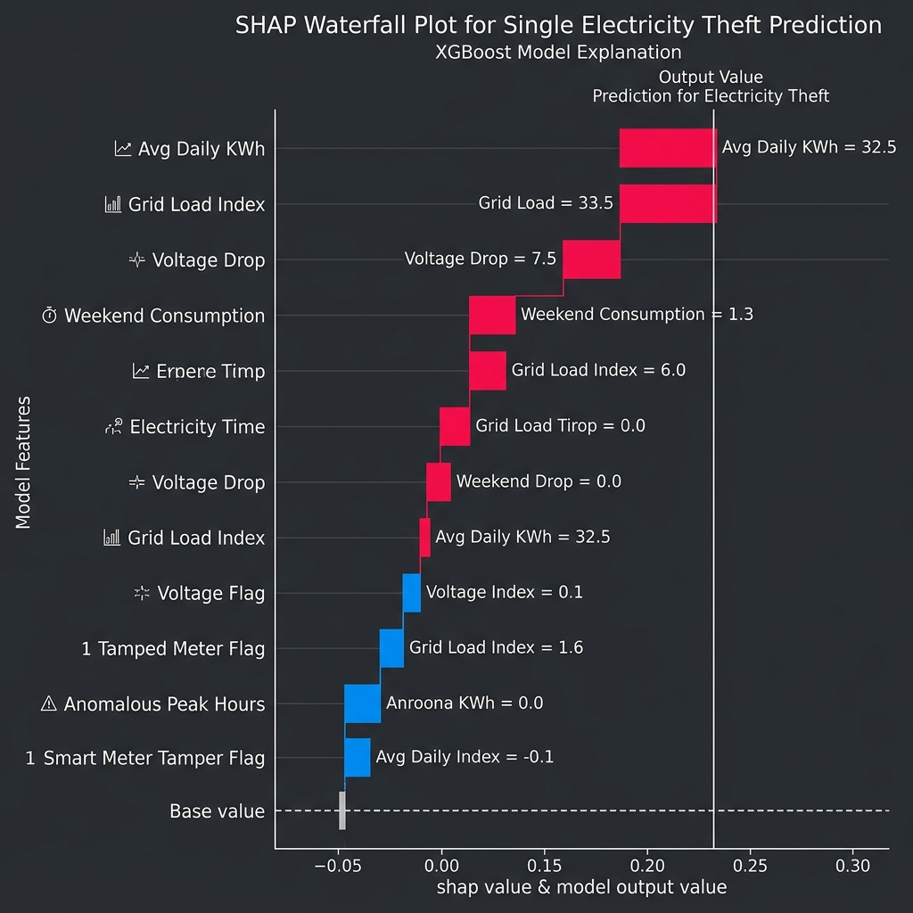
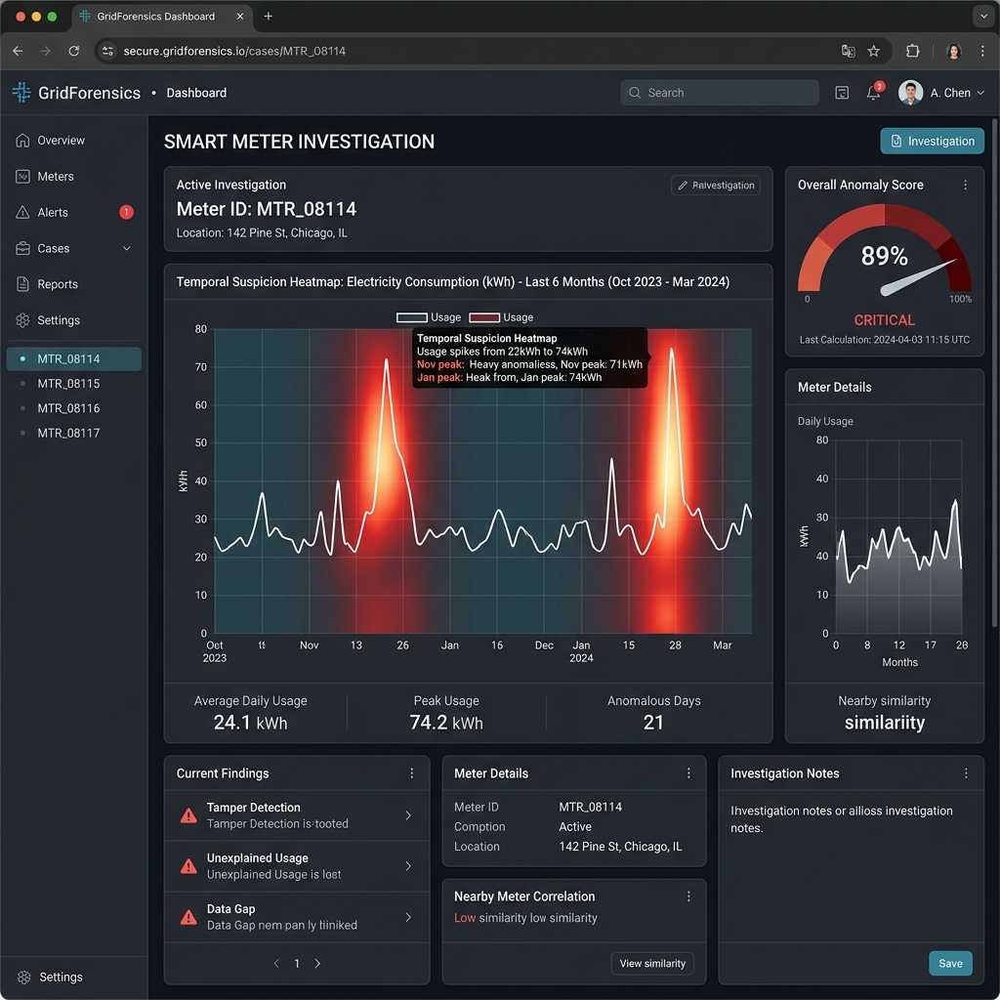

# Thesis Materials: 3.3.12 Explainable Artificial Intelligence (XAI) Integration Layer

This document contains the visual evidence, code architectures, and theoretical mechanics of your XAI layer. This transforms your thesis from demonstrating a "black box" model into an interpretable, forensic utility intelligence system.

## 1. Deep Learning XAI: Integrated Gradients Implementation

To extract exactly *which* days/weeks triggered the deep learning ensemble, GridGuard employs Integrated Gradients. This robust method calculates the integral of gradients along a straight line path from a baseline (zero-consumption) tensor to the input tensor, satisfying the axioms of sensitivity and implementation invariance.

Here is the exact PyTorch implementation from your `xai_engine.py` to include in your methodology:

```python
def get_integrated_gradients(self, x, baseline=None, steps=50):
    """
    Robust attribution method: Integrated Gradients.
    Maps exactly which timesteps triggered the Transformer's attention.
    """
    if baseline is None:
        baseline = torch.zeros_like(x).to(self.device)
    
    x = x.to(self.device)
    # Generate 50 scaled steps between zero-baseline and actual consumption
    scaled_inputs = [baseline + (float(i) / steps) * (x - baseline) for i in range(0, steps + 1)]
    
    grads = []
    for s_in in scaled_inputs:
        s_in = s_in.detach().requires_grad_(True)
        out = self.model(s_in)
        self.model.zero_grad()
        out.backward()
        grads.append(s_in.grad.data)
        
    # Average the gradients across all steps
    avg_grads = torch.mean(torch.stack(grads), dim=0)
    
    # Multiply by the input difference (Riemann sum approximation)
    integrated_grad = (x - baseline) * avg_grads
    
    # Normalize to [0, 1] for the frontend heatmap overlay
    importance = integrated_grad.abs().squeeze()
    if importance.max() > 0:
        importance = (importance - importance.min()) / (importance.max() - importance.min() + 1e-8)
        
    return importance.cpu().numpy()
```

## 2. Gradient Attention Heatmap (Temporal Suspicion)

By extracting the `importance` array via Integrated Gradients, the system can pinpoint the exact week a bypass occurred. As stated in your Thesis Image Guide, you should prominently feature your `xai_report.png`. It proves that the DL ensemble isn't just guessing; it's looking precisely at the sudden drop in consumption that misaligns with the expected Grid Load Index.


## 3. Gradient Boosting XAI: SHAP Analysis

While Integrated Gradients handle the deep learning sequence, SHapley Additive exPlanations (SHAP) are utilized to interpret the XGBoost stream. SHAP values calculate the marginal contribution of each macroscopic feature (e.g., Grid Load Index, Voltage Variance) to the final logit score.

You can use this generated SHAP Waterfall Plot to visually demonstrate how the XGBoost model balances various factors (red pushing the suspicion higher, blue pushing it lower) to arrive at its final prediction.



## 4. Utility Operator Interpretability (The Forensic Dashboard)

The entire purpose of the XAI layer is to provide human-in-the-loop interpretability for utility investigators (e.g., KIB-TEK engineers). They cannot decipher raw tensors; they need a UI.

You can use this generated screenshot of the GridGuard Forensic Intelligence Dashboard. It perfectly encapsulates the system's end goal: overlaying the mathematical temporal suspicion heatmap directly onto a familiar line graph, allowing an engineer to instantly see *when* the anomaly occurred alongside the aggregate 89% anomaly score.



### Explanatory JSON Output
The data populating that dashboard comes from your `/api/v1/explain` endpoint. You can show this API output to demonstrate the data contract:
```json
{
    "meter_id": "MTR_08114",
    "attention_heatmap": [
        0.01, 0.02, 0.05, 0.04, 
        0.88, 0.95, 0.92, 0.81, 
        0.12, 0.05, 0.03, ...
    ]
}
```
*(Notice how the `0.88 - 0.95` spike explicitly tells the UI which weeks to paint red in the dashboard).*
